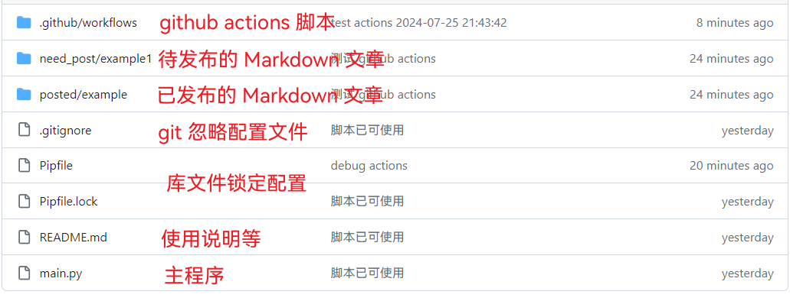
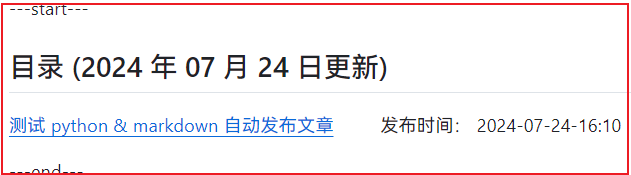
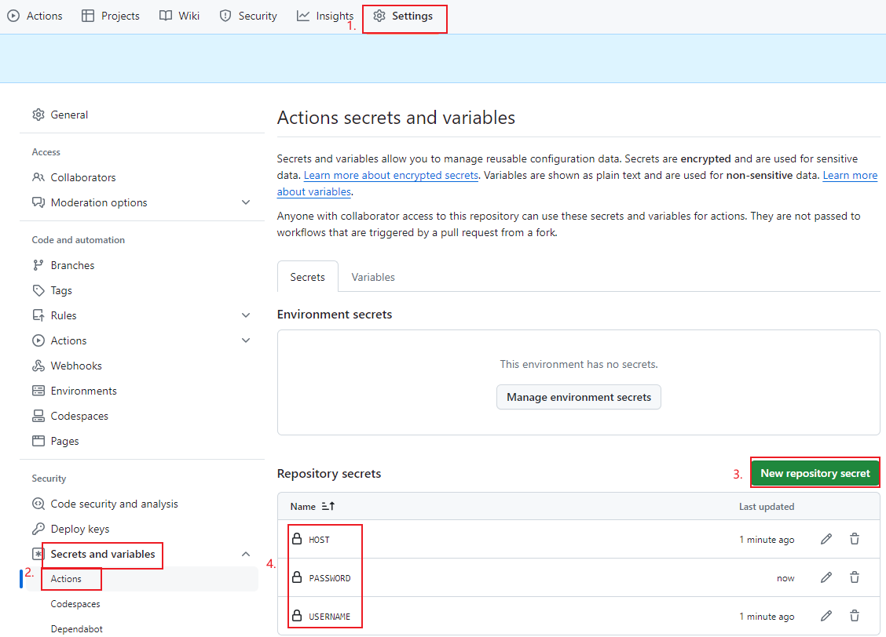
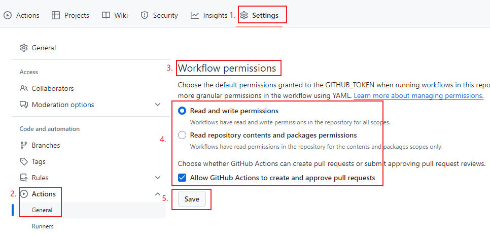
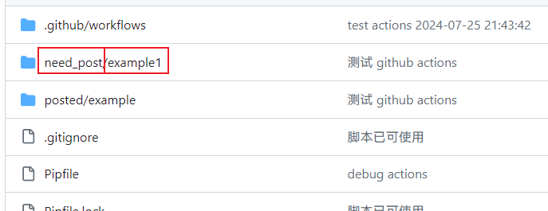

# Rublog 博客 Github 仓库

这个项目脱胎于 [WordPressXMLRPCTools](https://github.com/zhaoolee/WordPressXMLRPCTools) ，这为我提供了思路。

鉴于我不喜欢 xmlrpc ，所以使用 wordpress 的 restAPI 更新。

WordPress API 库来自于 [wordpress-markdown-blog-loader](https://github.com/binxio/wordpress-markdown-blog-loader)，轻微修改。

[点这里，跳过博客目录看仓库说明](#用github-actions写markdown文章自动更新到wordpress)

---start---

## 目录(2025年03月07日更新)

[🚀 ZSH：Bash的终极替代者！智能补全+插件生态+深度定制，开发者的效率神器！](https://www.rxx0.com/software/zsh-bashde-zhong-ji-ti-dai-zhe-zhi-neng-bu-quan-cha-jian-sheng-tai-shen-du-ding-zhi-kai-fa-zhe-de-xiao-lu-shen-qi.html)&emsp; &emsp; 发布时间： 2025-03-07-07:12

[Windows用户可看,2025年转投Linux必须知道的10件事](https://www.rxx0.com/software/windowsyong-hu-ke-kan-2025nian-zhuan-tou-linuxbi-xu-zhi-dao-de-10jian-shi.html)&emsp; &emsp; 发布时间： 2025-03-06-13:55

[如何将任何 Grafana 可视化导出到 CSV 文件、Microsoft Excel 或 Google Sheets](https://www.rxx0.com/software/ru-he-jiang-ren-he-grafana-ke-shi-hua-dao-chu-dao-csv-wen-jian-microsoft-excel-huo-google-sheets.html)&emsp; &emsp; 发布时间： 2025-02-18-03:03

[Ubuntu 使用 shell 分析磁盘占用二](https://www.rxx0.com/?p=4198)&emsp; &emsp; 发布时间： 2024-10-27-11:38

[Ubuntu 使用 shell 分析磁盘占用1](https://www.rxx0.com/?p=4195)&emsp; &emsp; 发布时间： 2024-10-27-11:37

[西门子博途（TIA)V19 在 Windows 11 下使用常见问题解决办法](https://www.rxx0.com/?p=4190)&emsp; &emsp; 发布时间： 2024-10-27-01:40

[西门子博途（TIA)V19 在 Windows 11 下安装问题解决办法](https://www.rxx0.com/?p=4183)&emsp; &emsp; 发布时间： 2024-10-27-01:40

[【编程向】学习一点算法和数学](https://www.rxx0.com/software/bian-cheng-xiang-xue-xi-yi-dian-suan-fa-he-shu-xue.html)&emsp; &emsp; 发布时间： 2024-09-06-13:51

[如何使用github actions 发布 markdown 文章到 WordPress 网站](https://www.rxx0.com/?p=4150)&emsp; &emsp; 发布时间： 2024-07-27-05:24

[使用 act 调试 github actions 技巧](https://www.rxx0.com/software/diao-shi-github-actions-de-4-chong-gong-ju.html)&emsp; &emsp; 发布时间： 2024-07-27-04:55

[两种方法解决 sourcetree 通过 ssh 连接 github Permission denied (publickey)问题](https://www.rxx0.com/software/liang-chong-fang-fa-jie-jue-sourcetree-tong-guo-ssh-lian-jie-github-permission-denied-publickey-wen-ti.html)&emsp; &emsp; 发布时间： 2024-07-26-10:58

[测试 python & markdown 自动发布文章](https://www.rxx0.com/software/test-python-and-markdown-to-automatically-publish-articles.html)&emsp; &emsp; 发布时间： 2024-07-24-16:10

---end---

## 用Github Actions写Markdown文章，自动更新到WordPress

- 写博客最舒服的格式是Markdown；

- 管理博客站最省心的方式是WordPress；

- 推广博客站最好的平台是Github；

这个项目可以让你用 Markdown 写博客，push 更新到 Github 后，Github Actions 自动将文章更新到 WordPress，并将文章网址更新到 README.md。



### 使用Github Actions 有什么好处？

Github Actions 可以让我们无需安装开发环境，即可完成代码的运行。


只需要新建 Markdown 文章, 然后更新到仓库，Github Actions会自动更新文章到 WordPress，并把文章链接更新到README.md。



### 如何保护自己的WordPress账户密码？

Github 有一个 secrets 功能，可以将用户名密码等关键信息保护起来，只有Github Actions可以读取到关键信息。

本项目需要设置三个secret

- WordPress登录用户名, 变量名为 USERNAME
- WordPress登录密码，变量名为 PASSWORD
- WordPress的域名，变量名为 HOST



### 允许 Github Actions 回写仓库

Github 安全保护功能越来越健全，需要单独开这个权限。开放方法如下：



### 如何新建文章？

在`need_post` `posted` 目录下的 example 复制改名之后继续编辑文件夹下的 `index.md` markdown文件即可。



### 文章管理：如何为文章分类/加关键词标签？

在 `.md` 文件顶部填写以下初始化信息，即可完成标题（title），标签（tags），分类（categories）的设置，**以下内容均为必填项目**。

``` tag and category
---
author: xinyu2ru
categories:
- software
date: 2024-07-24 08:21:00
excerpt: 这里写文章的摘要内容，这段文字应该出现在文章摘要。
image: images/banner.jpg
status: publish
title: 这里写文章的标题
focus-keywords: markdown upload wordpress
tags: markdown upload wordpress
---

```

## 标签(tags)和分类(categories)有什么区别？

标签(tags)是针对单篇文章的关键词，比如香蕉的标签有 **黄色**，**味甜** （标签是香蕉的属性）
分类(categories)是本篇文章的归属，比如香蕉的分类为 **水果**，**植物**

## 如何使用？

完成以上配置后

每次在`need_post` 文件夹新增或更新文章后，运行 git 指令即可！

``` git
git pull && git add _posts && git commit -m "update" && git push
```

也可以使用 git 管理软件进行提交

### Github README.md显示效果,（新增的文章排在首位）


## 如何用手机完成博客更新操作？

锤子便签，可以优雅舒适地写 Markdown 。

Obsidian，也是我现在主要用的编辑软件，电脑和手机均可用。

## Update

SEO 插件由 Yoast 改为 Rank Math

## Wordpress 需要安装的插件（Plugins）

- [Rankmath](https://rankmath.com/wordpress/plugin/seo-suite) SEO插件
- [REST API Meta Support](https://wordpress.org/plugins/rest-api-meta-support/) Wordpress 接口增强插件
