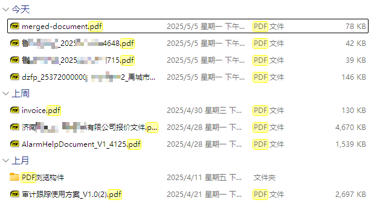
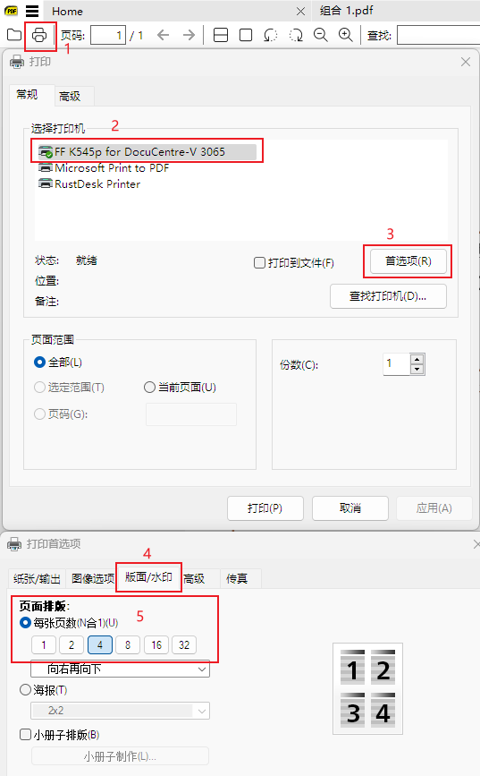

## PDF  是什么？

PDF 是一种用独立于应用程序、硬件、操作系统的方式呈现文档的文件格式。它源自 1991 年 Adobe Systems 共同创始人约翰·沃诺克发起的“Camelot项目”。2008年成为ISO标准的一部分。

随着全电发票的推进，打工人越来越多的接触到 PDF 这种文件格式。

没错，rublog 从小企业接触到最多的发票打印开始切入。

## PDF 发票的汇总

按照规范来讲，公司是需要存档 ofd 格式或者 xml 格式发票的。实际操作中，大家下载和存档的基本都是 pdf 格式。

rublog 建议您按公司下载对应格式的发票，汇总的时候统一用邮箱汇总或者手机微信汇总。1

邮箱汇总的时候一个公司的发票发送到一个邮箱，特别是有的老板让开到多家公司下的时候。2

QQ 邮箱有标签功能和文件夹功能。每次下载发票之后建议给该邮件打一个“已下载”的标签，月底整理邮件的时候将对应的已下载发票挪动到对应的“发票”/“年月份”文件夹中。3

手机微信汇总的时候可以使用“批量选择”，“汇总到聊天”功能，将本月的所有发票都发送到聊天助手，在电脑上将发票进一步处理。4

当然也可以下载到手机上指定的文件夹中，然后将文件夹复制到电脑上。

## PDF 发票的打印

一般公司要求电子发票打印成 A6 或者 A5 的尺寸，因为采购的报销单是 A6 或者 A5 的。rublog 公司的报销单是比 A6 长一节，所以 rublog 习惯打印成 A6 尺寸的。

这是之前 rublog 分享的如何把电子发票打印成 A6 尺寸：[如何快速的贴电子发票](https://www.rxx0.com/software/ru-he-kuai-su-de-tie-dian-zi-fa-piao.html)。

核心就是把下载的 pdf 发票先合并成一个 pdf 文件，然后在调用打印机的时候设置一张纸打印 4 页，具体操作可以参考[如何快速的贴电子发票](https://www.rxx0.com/software/ru-he-kuai-su-de-tie-dian-zi-fa-piao.html)。5

具体如何把文件夹中的发票合并成一个 pdf 文件，也可以参考上文哟！

在线工具：我自己的网站 [pdf 在线工具-pdf在线合并](https://pdf.kefuxx.com/merge-pdf.html)，支持 pdf 合并、pdf 拆分、pdf 转图片、图片转pdf，纯浏览器端操作，不需要上传。6

关键词搜索和功能做的都不错的 [24PDF tools](https://tools.pdf24.org/zh/) ,它有离线版，名字是 24PDF Creater，后面又下载链接。7

做的比较早的 [iLovePDF](https://www.ilovepdf.com/zh-cn),流行度还是不错的。8

一些朋友说，我们公司不允许上外网。

## 来吧，下面是工具软件

1、PDF 阅读器

推荐 SumatraPDF / Chrome 或者 edge 浏览器 / WPS PDF

rublog 个人喜欢 SumatraPDF，因为它允许绿色安装，我重装系统之后找到这个软件能继续运行。放在 U 盘上复制到任何电脑都能运行。

他们在 [SumatraPDF 官网](https://www.sumatrapdfreader.org/free-pdf-reader)上说了，小巧、快速、免费。

我使用 Chrome 浏览器，现在大部分浏览器内核都是 Chrome 包括 edge 浏览器，所以没找到 PDF 阅读器也没关系，把 pdf 文件拖到浏览器里就好了。9

为啥推荐 [WPS PDF](https://www.wps.cn/product/kingsoftpdf) 呢？ 因为现在很多用户已经安装了 WPS，顺带就安装了 WPS PDF。

## PDF 合并软件

坤Tools，作者在 [52pojie 发布](https://www.52pojie.cn/thread-1909757-1-1.html),软件不到 200M ，有合并PDF、PDF转WORD、图片转PDF等 38 个功能。不收费。10

pdf24-creator，官网[pdf24](https://tools.pdf24.org/zh/creator)，网站标注免费。合并PDF、PDF转WORD、图片转PDF等功能，一开始标注 24 个功能，现在远超 24 个功能。11

扫码，回复“ pdf软件 ”获取下载链接。

## PDF 打印软件

小傻瓜，能看 PDF 的软件都能调用打印机啦！！
