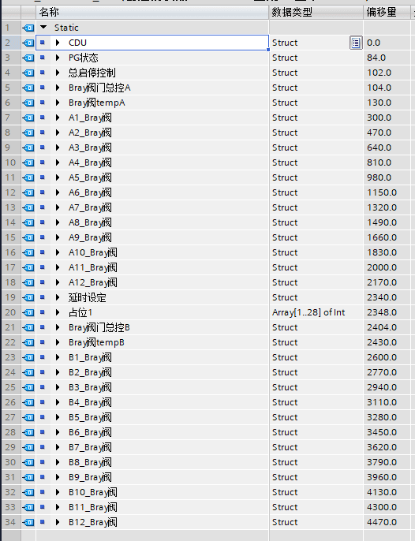
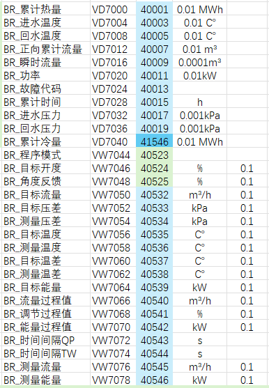
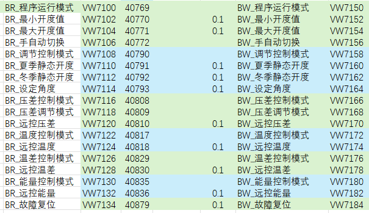
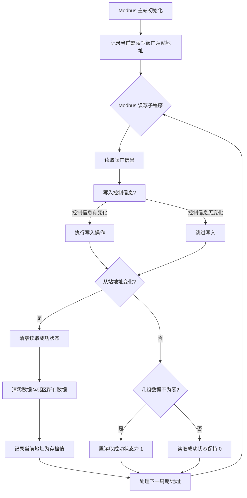

项目最开始的设计方案是使用西门子 1200 PLC 做主控逻辑，西门子 SMART SR30 PLC 做通讯，自带串口轮询 6~12 个通讯阀门，挂 SB CM01 通讯板通讯 CDU 主机。

后修改方案，CDU 主机可以通过网络 S7 协议直接读写控制。

<!--more-->

## 方案规划与对比

初步规划，使用 SR30 读写 12 个通讯阀门，占用数据存储区约 5000 Byte，读写轮询 132 个循环。

另外一种方案是每个阀门读写 7 个循环，数据存储区则需要占用约 8000 Byte ，读写轮询 84 个循环。。

如果考虑原方案需要读写 CDU，则程序写的比较复杂。

万一某个地方需要修改程序，则 11 台 SR30 PLC 的程序都修改 IP 地址再下载一遍。

改方案之后，西门子 1200 PLC 通过网络 S7 协议读写 CDU 设备。减少了 SR30 PLC 的逻辑，降低了程序的复杂度。考虑到通讯速度， SR30 读写 12 个通讯阀门仍然需要优化。

SR30 PLC 可以只写一台串口通讯设备的读写程序，通过修改串口从站地址，每个地址执行一遍通讯程序。数据存储占用也只需要 500Byte 左右。

Profinet IO 通讯最大支持 128 Byte，且使用 IW 和 QW ，需要数据转存储，最后选用 Put/Get 命令，直接读写数据到暂存数据块。

## 最后方案汇总

数据块存储规划如下图



数据存储总占用 4622 Byte 。比使用 SR30 设计数据点位更方便建立和修改。
当然 SR30 数据点也需要一组阀门通讯点位。如下图





## 阀门读写控制流程图

### 流程概述

西门子 1200 PLC 主控侧与 SR30 PLC 通讯接口侧之间，用于阀门状态读取与控制数据写入的读写控制流程。

### 西门子 1200 PLC 主控侧流程

```mermaid
graph TD
    A[开始] --> B{10Hz 周期性执行};
    B --> C[读取 SR30 阀门状态数据到暂存区 (temp)];
    C --> D[将暂存区控制数据写入 SR30 PLC];
    D --> E{读取成功?};
    E -- 是 --> F[同步暂存区数据到数据存储区];
    E -- 否 --> G[跳过同步];
    F --> H[阀门地址 + 1];
    G --> H;
    H --> I{地址 <= 安装阀门总数?};
    I -- 是 --> J[将控制数据赋值到暂存区];
    J --> K{考虑禁用/故障阀门?};
    K -- 禁用/故障 --> L[跳过该地址];
    K -- 正常 --> M[继续处理下一周期];
    L --> M;
    I -- 否 --> M;
    M --> B;
```

**详细说明:**

* **开始**: 流程启动。
* **10Hz 周期性执行**: 主控逻辑以固定频率（10Hz）循环执行。
* **读取 SR30 阀门状态数据到暂存区 (temp)**: 从 SR30 PLC 读取当前阀门的状态信息，并临时存储在 PLC 的一个数据块（暂存区）中。
* **将暂存区控制数据写入 SR30 PLC**: 将主控侧准备好的控制指令（可能来自其他逻辑）写入 SR30 PLC。
* **读取成功?**: 判断从 SR30 读取到的阀门状态数据是否有效（例如，数据格式正确，无通讯错误）。
* **同步暂存区数据到数据存储区**: 如果读取成功，将暂存区中的数据复制到永久性的数据存储区，用于历史记录或后续分析。
* **跳过同步**: 如果读取失败，则不进行数据同步。
* **阀门地址 + 1**: 准备处理下一个阀门，将当前处理的从站地址加一。
* **地址 <= 安装阀门总数?**: 检查当前处理的地址是否超出了系统中安装的阀门总数。
  * **是**: 继续处理。
  * **否**: 表示所有阀门已处理完毕，等待下一个周期。
* **将控制数据赋值到暂存区**: 为下一个周期的写入操作，准备或更新要发送给阀门的控制数据到暂存区。
* **考虑禁用/故障阀门?**: 在处理下一个阀门地址前，检查是否有逻辑配置了禁用某个阀门，或检测到某个阀门处于断电/故障状态。
  * **禁用/故障**: 跳过该地址，不进行读写操作，直接处理下一个地址（或等待下一周期）。
  * **正常**: 继续正常处理。
* **继续处理下一周期**: 完成当前阀门的逻辑后，等待下一个 10Hz 周期。

---

## 西门子 SR30 PLC 通讯接口侧流程



**详细说明:**

* **Modbus 主站初始化**: SR30 PLC 作为 Modbus 主站进行初始化设置。
* **记录当前需读写阀门从站地址**: 记录当前 PLC 主控侧指定要进行读写的阀门（从站）的地址。
* **Modbus 读写子程序**: 调用 Modbus 通讯子程序来执行读写操作。
* **读取阀门信息**: 从当前指定的从站地址读取阀门的当前状态和信息。
* **写入控制信息?**: 检查主控侧发送的控制指令与阀门当前实际控制指令是否有差异。
  * **控制信息有变化**: 执行写入操作，将新的控制指令发送给阀门。
  * **控制信息无变化**: 跳过写入操作，以减少通讯负担。
* **从站地址变化?**: 比较当前处理的从站地址与之前记录的存档地址是否一致。
  * **是**: 表示正在处理一个新的阀门或地址序列。
    * **清零读取成功状态**: 将所有阀门的读取成功标志重置为无效。
    * **清零数据存储区所有数据**: 清空用于存储阀门数据的区域（可能指暂存区或特定存储区）。
    * **记录当前地址为存档值**: 将当前处理的地址设置为新的存档值，用于下一次地址变化判断。
    * **否**: 表示仍在处理同一阀门或同一地址序列。
* **几组数据不为零?**: 检查读取到的阀门数据（可能指关键参数）是否有效（不为零）。
  * **是**: 判定本次读取成功。
    * **置读取成功状态为 1**: 将当前阀门的读取成功标志设置为有效。
    * **否**: 判定本次读取失败或数据无效。
    * **读取成功状态保持 0**: 当前阀门的读取成功标志保持无效状态。
* **处理下一周期/地址**: 完成当前操作后，准备处理下一个读写请求或等待下一个周期。

## 方案总结

西门子 SR30 写循环比较麻烦。

使用 1200 PLC 编写程序，循环只需要一条 for 语句。复制数据 POKE_BLK 比 MOV 指令更方面。

使用 SCL 语言也可以更方便的写判断逻辑（个人感觉）。
