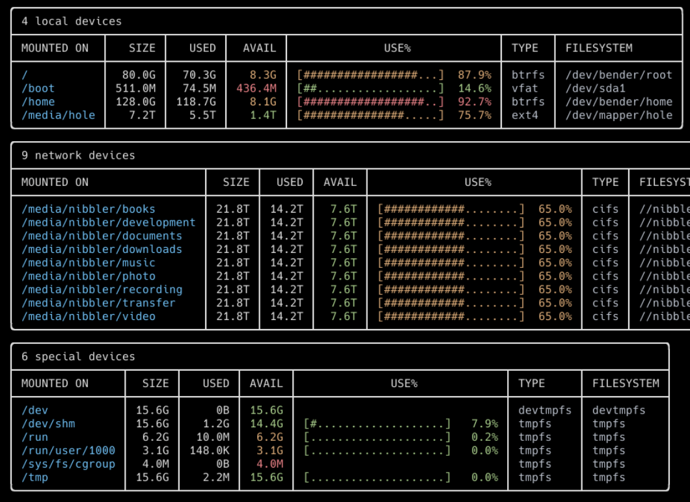

- [背景](#背景)
- [duf 安装使用](#duf-安装使用)
- [使用教程](#使用教程)
  - [过滤参数](#过滤参数)
  - [输出参数](#输出参数)
  - [颜色显示和细节参数](#颜色显示和细节参数)
  - [输出结果](#输出结果)
  
## 背景

Rublog 有几个 vps 运维几个网站，有几次发现某个 vps 磁盘会占满，导致服务停止。

Rublog 不想额外付费扩容，就只有删掉一些文件了。

上一篇文章介绍了 `ncdu`, shell 可用的，无需桌面服务。

软件在 shell 表现如图



## duf 安装使用

软件支持 Linux, FreeBSD, OpenBSD, macOS, Windows

```csharp
Linux
Arch Linux: pacman -S duf
Ubuntu 22.04 / Debian unstable: apt install duf
Nix: nix-env -iA nixpkgs.duf
Void Linux: xbps-install -S duf
Gentoo Linux: emerge sys-fs/duf

BSD
FreeBSD: pkg install duf
OpenBSD: pkg_add duf

macOS
with Homebrew: brew install duf
with MacPorts: sudo port selfupdate && sudo port install duf

Windows
with Chocolatey: choco install duf
with scoop: scoop install duf

Android
Android (via termux): pkg install duf

Binaries
可以下载 duf 二进制安装包 Linux, FreeBSD, OpenBSD, macOS, Windows，Alpine, Debian & RPM
```

[可以下载 duf 二进制安装包 Linux, FreeBSD, OpenBSD, macOS, Windows，Alpine, Debian & RPM](https://github.com/muesli/duf/releases)

看下帮助，`duf` 支持一些参数，包括排除一些文件，导出结果到文件中等。

## 使用教程

你可以直接运行 `duf` 。

`duf` 支持参数输入，可以指定设备或者挂载点，也可以通过参数列出所有可访问设备或者文件夹。

### 过滤参数

指定参数只显示内容或者隐藏内容:

```hide
duf --only local,network,fuse,special,loops,binds
duf --hide local,network,fuse,special,loops,binds
```

也可以指定特定格式的文件系统:

```hide-type
duf --only-fs tmpfs,vfat
duf --hide-fs tmpfs,vfat
```

或者指定挂载点:

```mounted
duf --only-mp /,/home,/dev
duf --hide-mp /,/home,/dev
```

支持*通配符:

```Wildcards
duf --only-mp '/sys/*,/dev/*'
```

### 输出参数

对输出排序:

可用的参数有: `mountpoint`, `size`, `used`, `avail`, `usage`, `inodes`, `inodes_used`, `inodes_avail`, `inodes_usage`, `type`, `filesystem`.

隐藏或者显示内容列:

```culumns
duf --output mountpoint,size,usage
```

可用的参数有: `mountpoint`, `size`, `used`, `avail`, `usage`, `inodes`, `inodes_used`, `inodes_avail`, `inodes_usage`, `type`, `filesystem`.

可以列出节点信息，隐藏块信息：

```列出inodes
duf --inodes
```

如果 `duf` 没有正确识别终端颜色方案，你也可以自己指定参数、主题。

好像不支持 putty 安颜色显示。

```指定主题
duf --theme light
```

### 颜色显示和细节参数

`duf` 使用红、绿、黄显示磁盘或者文件夹的使用率和磁盘可用率，你可以通过调整参数调整一些细节。

```比例调整
duf --avail-threshold="10G,1G"
duf --usage-threshold="0.5,0.9"
```

### 输出结果

软件支持把分析结果导出为 JSON 格式文件:

```导出json
duf --json
```
