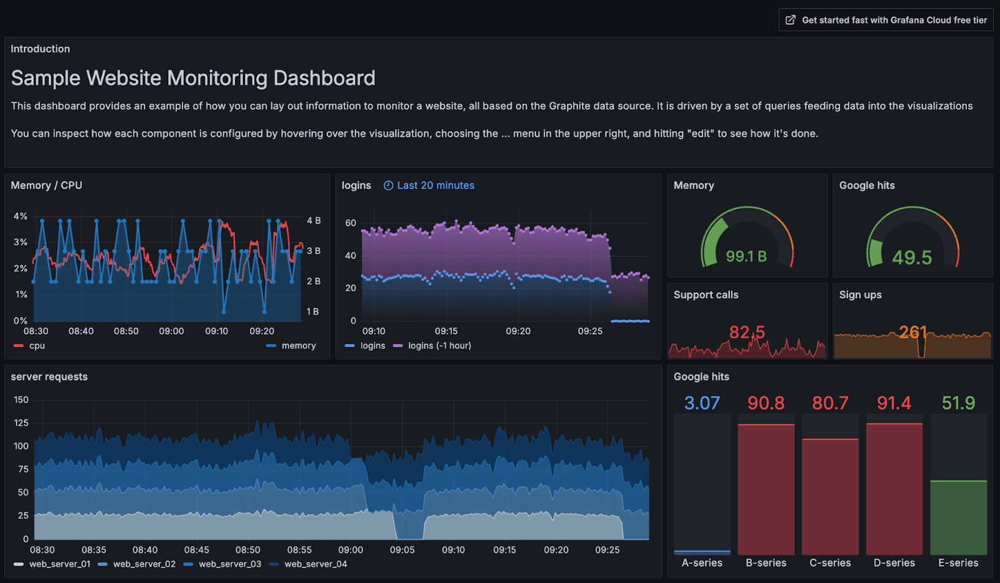
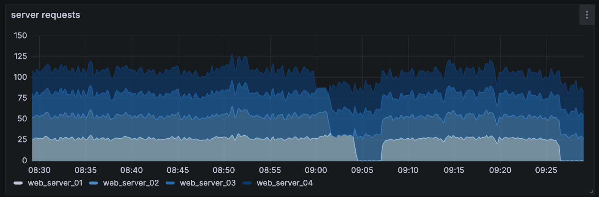
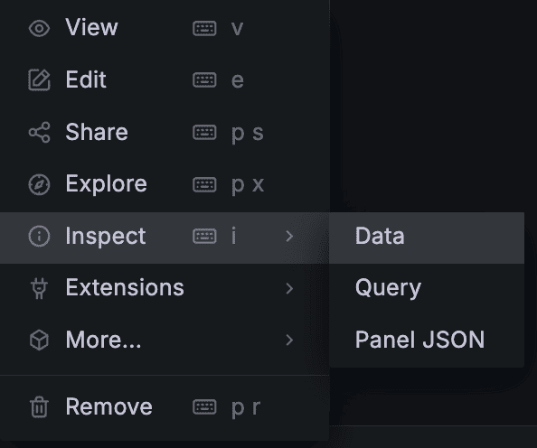
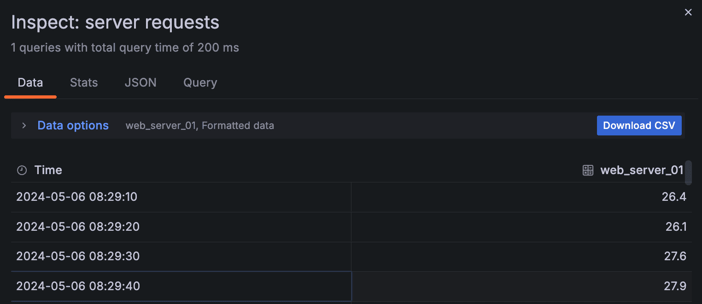
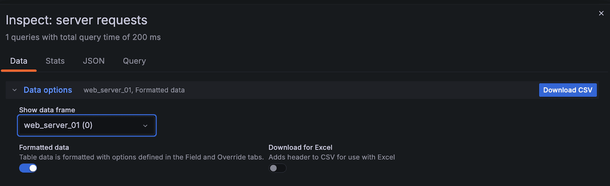
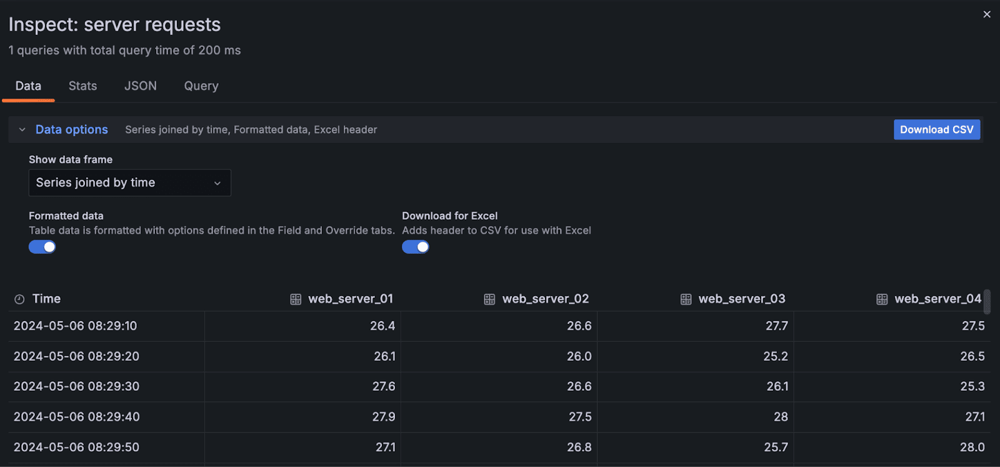
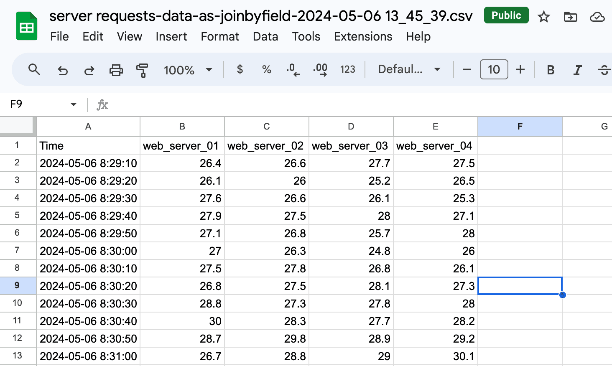
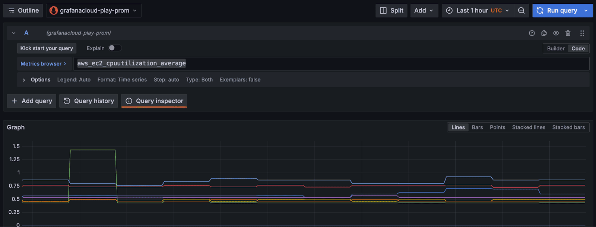
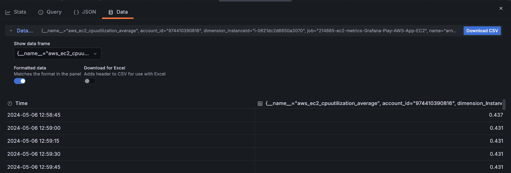

## 如何将任何 Grafana 可视化导出到 CSV 文件、Microsoft Excel 或 Google Sheets

Grafana 仪表板是将大量技术信息整合成一张方便的图片的好方法。有时，将特定 Grafana 可视化中的数据导出为另一种格式也很有用，这样您就可以进一步分析它并与他人共享。 

在这篇博文中，我们将介绍如何导出您使用的任何 Grafana 可视化的 CSV 数据。这样可以轻松地将数据导入流行的电子表格应用程序，例如 Microsoft Excel 或 Google Sheets。本文中描述的步骤在三个方面具有通用性：

* 它们适用于任何 Grafana 可视化，因为在幕后，所有可视化都只是将一系列数据框绘制到屏幕上。 
* 它们适用于任何数据源（关系型或非关系型），因为查询结果会转换成相同的数据框。
* 它们将在 Grafana 仪表板上或任何 Grafana 查询中发挥作用。

我们将使用 Grafana Play 上的 [Sample Website Monitoring Dashboard](https://play.grafana.org/d/000000003/1-graphite3a-sample-website-dashboard?orgId=1) 示例网站监控仪表板。

您可以使用该示例仪表板执行本文中显示的所有操作。

### 选择要导出的数据

让我们从仪表板中的服务器请求数据开始，该数据显示在下面的时间序列面板中。请注意，在图例中，我们显示了四个不同的 Web 服务器的堆叠线：01、02、03 和 04。

在可视化顶部的三点菜单中，选择**“检查”** > **“数据”**。

在右侧，您会看到一个滑出的托盘。这是可视化中显示的表格格式版本的数据，带有蓝色的**下载 CSV**按钮。  

_**如果这就是您所需要的，那么您就大功告成了！**_ 但是这个功能还有更多功能；继续阅读以了解它的工作原理、如何与 Grafana Explore 一起使用它以及您还可以用它做什么。

### 选择并下载数据框

从 Grafana 可视化中获取 CSV 和表格数据并不像看起来那么明显；从数据源进入插件的数据可能有许多不同的格式（例如 JSON、行和列或 CSV），但当它通过其余的门进入可视化时，它总是在数据框中。
当您导出数据时，您正在导出由某些查询产生的 Grafana_数据框_——您不是直接从底层数据源导出数据。

在这种背景下，让我们展开**“检查”**菜单中的**“数据选项”**部分，看看除了简单地导出到 CSV 之外我们还能做什么。

如果您在上一步中仔细观察，您可能会注意到我们导出的数据仅适用于第一个 Web 服务器（web\_server\_01），而不是所有四个框架。在上面的对话框中，我们可以看到 Grafana 将整个可视化拆分为四个框架，我们可以单独导出每个框架。

但是，如果您的时间序列有多行（如我们在此处的示例中所示），您通常希望电子表格中包含所有数据，而不仅仅是其中一行。为此，我们可以选择**按时间连接的系列**选项，该选项会导出您在可视化中看到的所有数据。 

我们示例中的四个系列是四个独立的数据集，每个数据集包含一个时间和单个 Web 服务器的一个数据点。当我们按时间将它们连接起来时，我们会将所有数据重新组合到我们之前在时间序列图中看到的同一时间线上。 

如下所示，还有适用于 CSV 处理应用程序和 Excel 的格式化数据和添加标题的选项。我将选择**“下载到 Excel”**以将该标题行添加到我的数据中，然后单击**“下载 CSV”**。

下载的结果文件名为`server requests-data-as-joinbyfield-2024-05-06 13_45_39.csv`，这很方便，因为它会告诉我们导出了什么内容以及何时导出。这意味着，如果您对许多可视化执行此操作，则可以将数据分开并记住导出的内容。

最后一步是将生成的 CSV 导入 Google 表格、Microsoft Excel 或您使用的任何其他应用程序。由于标题已经存在，因此数据应该看起来像这样：

### 从 Grafana Explore 导出数据

如果您还没有仪表板，您可能只想使用 Grafana Explore 来运行查询并导出数据。这也是可行的。

让我们看一下Play 上的 Prometheus 指标探索的链接。在探索视图中，我们正在对执行一个非常简单的 PromQL 查询`aws_ec2_cpuutilization_average`。

在这里，我们点击**查询检查器**按钮来查看发送到数据库的查询的详细信息。

在下面打开的托盘中，右侧标有**“数据”**的选项卡将显示我们从面板可视化中导出数据时看到的所有相同选项。上面所说的一切都以同样的方式适用于此：数据框的选择、标题行以及如何导出。

## 总结

Grafana 在内部将您的数据作为一系列数据框来处理，无论这些数据来自何处或最初如何存储和查询。这意味着导出数据相当简单；我们只需将这些数据框转换为 CSV 文件，您就可以将其用于任何电子表格应用程序或任何其他软件。