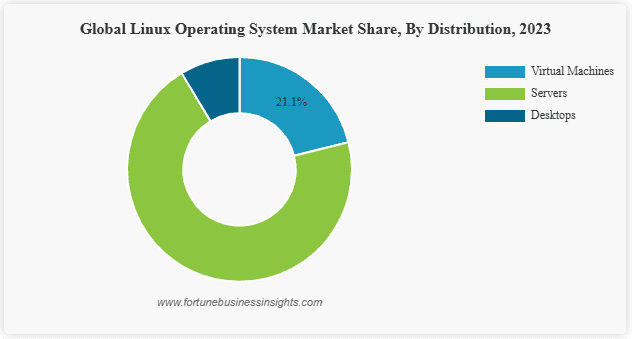
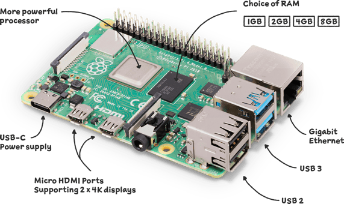
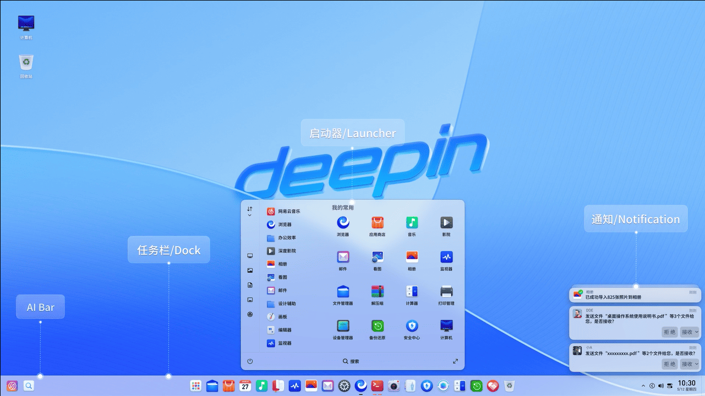
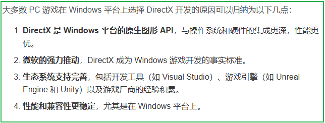
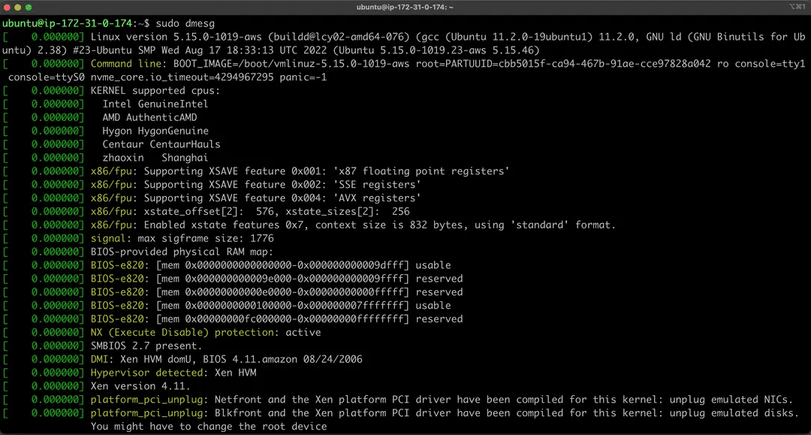
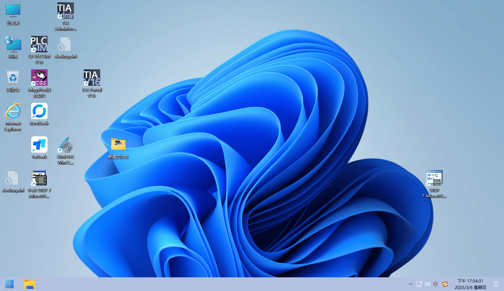
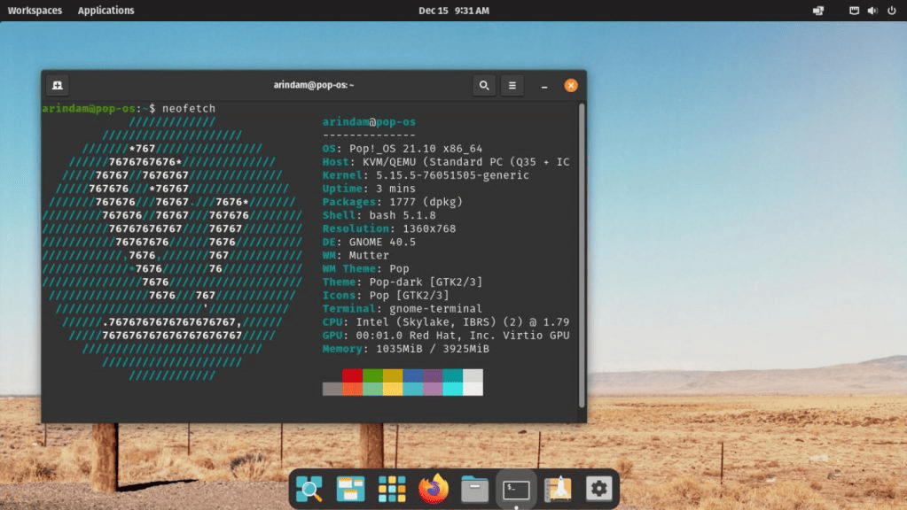

2025 年了，rublog 又想折腾新操作系统玩玩，操作系统对日常使用有着重大影响。 Linux 系统与 Windows 系统作为两大主流操作系统，各自拥有庞大的用户群体和独特的应用场景。

Linux 系统能否替代 Windows 系统，这一问题的答案并非绝对，而是取决于具体的使用场景和用户需求。rublog 将从多个维度对这一问题进行综合分析，并探讨未来的发展趋势。

## 一、 Linux 可替代 Windows 的场景

### （一）服务器与云计算： Linux 的天然优势

在服务器和云计算领域， Linux 系统已经占据了主导地位。其开源特性使得企业可以根据自身需求进行高度定制化，从而更好地满足对性能、稳定性和安全性要求极高的场景。例如，百度、淘宝等大型互联网企业，其服务器几乎全部运行 Linux 系统。 Linux 的开源生态不仅提供了丰富的软件资源，还允许企业自主优化系统性能，降低运营成本。

此外， Linux 在云计算领域的表现也十分出色。其轻量级的特性使得虚拟化和容器化技术得以高效运行，为云计算提供了强大的技术支持。例如，Docker 容器技术就是基于 Linux 内核开发的，它极大地简化了应用程序的部署和管理。相比之下， Windows 系统在服务器领域的市场份额逐渐缩小，主要集中在一些特定的企业级应用中。

*Linux 在全球服务器市场的占比*

### （二）开发与科研：开发者的首选

对于开发者和科研人员来说， Linux 系统是首选的开发环境。它提供了丰富的编程工具和开源软件生态，支持多种编程语言和开发框架。例如， Linux 自带的GCC编译器和Git版本控制系统，为开发者提供了强大的开发工具。此外， Linux 的多用户协作功能和长期运行的稳定性，使其成为科研计算和大规模数据处理的理想选择。

在科研领域， Linux 系统广泛应用于高性能计算（HPC）和人工智能（AI）研究中。例如，全球大多数超级计算机都运行 Linux 系统。其开源特性和高度定制化能力，使得科研人员可以根据具体需求优化系统性能，从而提高研究效率。

### （三）嵌入式系统与物联网： Linux 的轻量化优势

在嵌入式系统和物联网领域， Linux 系统因其轻量化和强大的硬件兼容性而被广泛应用。智能家居设备、工业控制系统、智能穿戴设备等都大量采用 Linux 系统。例如，Raspberry Pi（树莓派）是一款基于 Linux 的微型计算机，广泛应用于教育和DIY项目中。

 Linux 的开源生态使得开发者可以根据不同硬件平台进行定制化开发，从而实现高效的资源利用。此外， Linux 的低功耗和高稳定性也使其成为物联网设备的理想选择。相比之下， Windows 系统在嵌入式领域的应用相对较少，主要集中在一些特定的工业自动化设备中。

*图3： Linux 在物联网设备中的应用*

### （四）日常办公：国产 Linux 系统的崛起

近年来，国产 Linux 系统（如深度deepin）在办公领域的表现令人瞩目。深度deepin系统高度适配了办公需求，支持WPS、微信等主流办公软件。其操作逻辑与 Windows 系统相似，用户迁移成本极低。此外，深度deepin还提供了丰富的应用商店，用户可以轻松安装和管理各类软件。

在政府和企业办公领域，国产 Linux 系统已经逐渐替代了部分 Windows 系统。例如，一些地方政府部门已经全面采用深度deepin系统进行日常办公。其安全性和自主可控性得到了用户的高度认可。

*深度deepin系统的桌面界面*

## 二、 Linux 暂无法完全替代 Windows 的场景

### （一）专业软件与游戏： Windows 的生态优势

尽管 Linux 系统在技术领域表现出色，但在专业软件和游戏领域， Windows 系统仍然占据主导地位。部分 Windows 独占软件（如 Adobe 全家桶）需要通过兼容层（如Wine）或虚拟机运行，但往往存在性能损耗或功能限制。例如， Adobe  Premiere Pro在 Linux 下的性能表现不如 Windows ，且部分插件无法正常使用。

在游戏领域， Windows 系统仍然是主流。大多数游戏开发商优先为 Windows 平台开发游戏， Linux 平台的游戏资源相对匮乏。虽然近年来 Linux 游戏生态有所改善，但与 Windows 相比仍有较大差距。

*图5： Windows 平台的游戏生态*

### （二）硬件驱动与兼容性： Linux 的短板

尽管国产 Linux 系统对近五年内的硬件支持良好，但在老旧设备或特殊外设方面， Linux 系统仍可能面临驱动问题。例如，一些老旧的打印机或扫描仪可能无法在 Linux 系统下正常工作。此外，部分高端显卡（如NVIDIA的某些型号）在 Linux 下的驱动支持也存在不足。

相比之下， Windows 系统对硬件的兼容性更强，几乎所有的硬件设备都能在 Windows 下正常工作。这种硬件兼容性优势使得 Windows 在一些特定场景中仍然是不可替代的。

*Linux 系统下的硬件兼容性问题*

### （三）普通用户习惯： Windows 的用户友好性

对于普通用户来说， Windows 系统的图形化界面和商业软件生态更贴近大众习惯。 Windows 系统提供了丰富的软件资源和直观的操作界面，用户无需学习复杂的命令行操作。相比之下， Linux 系统的操作相对复杂，学习成本较高。

此外， Windows 系统的商业软件生态也更为完善。例如，Microsoft Office套件在办公领域的普及程度远高于 Linux 下的WPS。这种用户习惯和软件生态的优势使得 Windows 在消费级市场中仍然占据主导地位。

*Windows 系统的用户界面*

## 三、替代趋势与建议

### （一）企业用户：逐步采用 Linux

对于企业用户来说，逐步采用 Linux 服务器是一个明智的选择。 Linux 系统的稳定性和安全性能够有效降低企业的运营风险。同时，企业可以通过虚拟机兼容关键的 Windows 应用，从而实现无缝过渡。例如，一些大型企业在服务器端全面采用 Linux 系统，而在客户端保留部分 Windows 系统，以满足特定应用需求。

此外，企业在云计算和大数据领域也应优先选择 Linux 系统。其开源生态和高度定制化能力能够为企业提供更大的灵活性和成本优势。

### （二）个人用户：根据需求选择

对于个人用户来说，如果主要用于办公和学习，国产 Linux 系统已经能够满足大部分需求。例如，深度deepin系统提供了良好的办公软件支持和用户友好的界面。然而，如果用户涉及专业设计或游戏，建议保留 Windows 系统。例如，设计师可以使用 Windows 系统运行 Adobe 全家桶，而日常办公则可以使用 Linux 系统。

此外，个人用户也可以通过双系统安装的方式，同时使用 Linux 和 Windows 系统。这种方案既满足了专业需求，又降低了学习成本。

### （三）开发者： Linux 是更优选择

对于开发者来说， Linux 系统无疑是更优的选择。其稳定性和开源生态为技术探索提供了广阔的空间。 Linux 系统提供了丰富的开发工具和编程语言支持，能够满足开发者在不同领域的开发需求。

此外， Linux 系统的多用户协作功能和长期运行的稳定性也使其成为科研计算和大规模数据处理的理想选择。例如，许多高校和科研机构的开发环境都基于 Linux 系统。

*开发者优先选择 Linux 系统*

## 四、结论与展望

综上所述， Linux 系统在多数技术场景中已经能够替代 Windows 系统，但在消费级市场中仍需根据具体需求进行权衡。随着技术的不断发展， Linux 系统在硬件兼容性和用户友好性方面的表现将逐步改善。未来， Linux 系统有望在更多领域实现对 Windows 系统的替代。

然而， Windows 系统凭借其强大的商业软件生态和用户习惯优势，仍将在消费级市场中占据重要地位。因此，用户在选择操作系统时，应根据自身的使用场景和需求，做出最适合自己的选择。

在未来的数字化时代，操作系统的选择将更加多样化。 Linux 系统和 Windows 系统将各自发挥其优势，共同推动技术的发展和应用。无论选择哪种操作系统，用户都应关注其安全性、稳定性和兼容性，以实现高效、可靠的计算机使用体验。