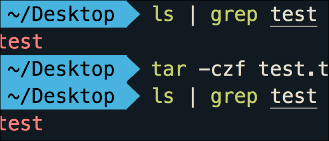

随着时间的推移，新的软件不断的出现，新的软件可能提供更好的体验，zsh 就是一款提供了更好体验的软件。ZSH（Z Shell）是一种基于Bash的增强型命令行shell，提供智能化的自动补全、高级交互特性、定制化能力，并且拥有强大的插件生态。



## 为什么使用 zsh 替代 bash

**1. 智能化的自动补全**
ZSH支持命令、参数、文件路径的深度补全，例如输入`git ch<Tab>`可自动补全为`git checkout`，甚至能列出当前Git分支供选择。其补全逻辑基于上下文动态分析，比Bash的静态补全更智能。

**2. 强大的插件生态**
通过Oh-My-Zsh等框架，ZSH可轻松集成数百种插件，如：
• **Git插件**：提供`gco`（checkout）、`gst`（status）等快捷命令
• **智能跳转**：`z`插件支持模糊匹配历史目录，如`z Doc`快速跳转至`Documents`目录
• **语法高亮**：实时显示命令错误，提升可读性

**3. 高级交互特性**
• **拼写纠错**：输入`gti status`会提示纠正为`git status`
• **历史管理**：支持跨会话共享命令历史，模糊搜索历史命令（如`docker`快速定位相关操作）
• **通配符扩展**：支持递归匹配（`**/*.txt`）和排除模式（`*.txt~README.txt`）

**4. 定制化能力**
用户可通过`.zshrc`文件自定义：
• **主题**：如`agnoster`显示Git分支/时间戳，`powerlevel10k`支持完全自定义
• **快捷键**：绑定`Ctrl+R`快速搜索历史命令
• **环境变量**：动态调整PATH等配置

## 安装 zsh

在 ubuntu 系统里面使用下面的命令安装 zsh 。

```ubuntu
sudo apt install zsh
```

安装 zsh 后，通过`chsh -s $(which zsh)`切换默认shell即可体验。

## 安装 Oh-My-Zsh

Oh-My-Zsh 是 ZSH 最流行的插件框架，它还附带许多内置插件和主题。还有一些其他的插件框架，包括 Antigen，它是 ZSH 的一个完整的包管理器，但是 Oh-My-Zsh 有大量内置的插件并且做得很好。

Oh-My-Zsh 有一个简单的安装脚本，您可以运行：

```ubuntu
sh -c "$(curl -fsSL https://raw.githubusercontent.com/robbyrussell/oh-my-zsh/master/tools/install.sh)"
```

_我安装的时候因为 github 无法直接访问，安装失败了好几次。_

您可以通过将插件添加到位于 ~ 目录中的 .zshrc 文件来启用和禁用插件。


您可以在 Oh-My-Zsh 存储库中获得完整的插件列表。

## 安装主题

zsh 有很多主题，powerlevel9k 是迄今为止最酷的。它添加了一个右对齐的信息框，与 git 和命令历史记录的集成，令人难以置信的自定义，并将其全部包装在一个基于 vim 的 powerline 插件的光滑界面中。

您需要在 [macOS](https://cn.mac-os.org/?cat=macos) 或任何具有 24 位颜色的终端上使用 iTerm，以充分利用 powerlevel9k（或任何 ZSH 主题，真的）。

要设置 powerlevel9k（如果你安装了 Oh-My-Zsh）只需将存储库克隆到 .oh-my-zsh 自定义主题文件夹中：

```git
git clone https://github.com/bhilburn/powerlevel9k.git ~/.oh-my-zsh/custom/themes/powerlevel9k
```

然后你需要在 .zshrc 中启用它：

```ini
ZSH_THEME="powerlevel9k/powerlevel9k"
```

之后，获取您的 .zshrc，您应该会看到应用的更改。


如果需要，您可以通过在 .zshrc 中定义 POWERLEVEL9K\_LEFT\_PROMPT\_ELEMENTS 来自定义默认提示。这是我的，有一个最小的提示：

```ini
POWERLEVEL9K_LEFT_PROMPT_ELEMENTS=(vcs dir rbenv)
POWERLEVEL9K_RIGHT_PROMPT_ELEMENTS=(root_indicator background_jobs status load)
```