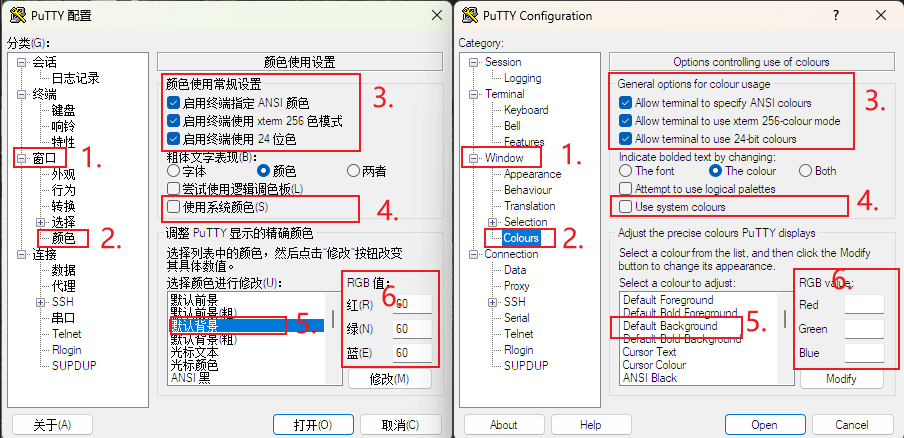
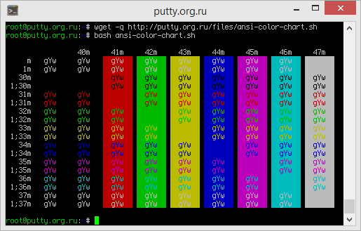
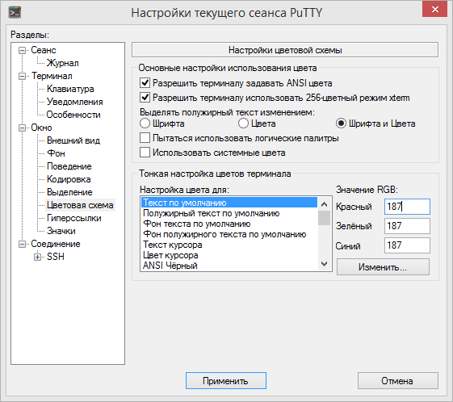
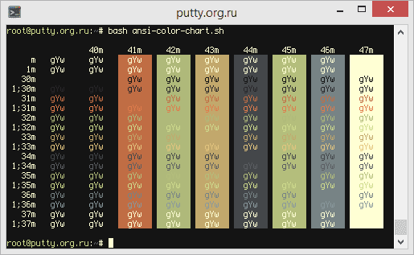

## PuTTY  是什么？

PuTTY 是一款免费开源的轻量级 SSH 客户端工具，尽管市面上有很多的终端工具，但 rublog 一直选择汉化版的 PuTTY 作为远程运维 Linux 系统的工具。

PuTTY 全面兼容 SSH-1 和 SSH-2 协议，支持多种加密算法，提供加密传输和身份验证功能，保障数据安全。此外，PuTTY 还支持 Telnet、Rlogin、串口连接及 SFTP/SCP 文件传输协议，满足多样化需求。界面设计简洁，功能丰富，支持会话管理、日志记录、公钥认证和 X11 转发，防止中间人攻击。PuTTY 还可通过 PuTTYgen 生成密钥对，自定义终端参数，适应不同场景。PuTTY 凭借免费、轻量、跨平台、安全可靠等特性成为服务器管理、网络调试和远程开发的首选工具。[官网地址](https://www.chiark.greenend.org.uk/~sgtatham/putty/latest.html)仅有英文。

PuTTY 默认是黑色背景，白色字体，用户可以通过更改系统 ANSI 颜色的显示来自定义 PuTTY 控制台的外观。

## PuTTY 颜色支持

在设置配色方案之前，请检查 PuTTY 会话的几个配置参数的状态：

在 Window/Color Scheme 面板中：

* “允许终端设置 ANSI 颜色”选项已启用。
* “允许终端使用 256 色 xterm 模式”选项已启用。
* “Highlight bold text with change” 选项用于指定 “Color” 或 “Font and Color”。

在 Terminal （终端） 面板中：

* “Use System Color”（使用系统颜色）选项已启用。



在“连接/数据”面板（连接前可用）的“端子类型字符串”字段中，指定：

* `xterm-256color` — 当连接到 Mac OS X 时，用于使用 Emacs/Vim 进行完整的 PuTTY 工作，用于其他现代应用程序;
* 或 `xterm-color` — 某些脚本（包括 Ubuntu 中的 `.bashrc`）仍然仅在 `TERM` 变量设置为给定值时启用颜色支持。

（`TERM` 环境变量不会影响 PuTTY 感知颜色的能力，它只告诉服务器应用程序终端的类型、支持的颜色数量。即使使用 `xterm-color`（支持 16 种颜色），PuTTY 也能够在不询问 `TERM` 的应用程序中显示 256 种颜色。

## 配色方案定制

256 色模式仅由某些程序使用，但在终端的正常工作中，仅使用 ANSI 系统颜色 - 16 种颜色（第一个屏幕截图中的“系统颜色”），加上一些定义默认文本颜色、背景颜色、光标颜色等的特殊名称。

客户端 （PuTTY） 和终端服务器 （SSH） 都参与远程终端控制台的着色。  
除了要着色的特定字符集外，服务器程序还发送控制序列，告诉该字符应使用的颜色名称。  
反过来，客户端确定此颜色在用户终端窗口中的外观。

例如，服务器告诉您以 “Green” 颜色绘制某某元素。但随后客户自己决定这种绿色是什么：绿松石绿、淡绿色、梨绿色或任何其他颜色。

[ansi-color-chart.sh](https://putty.org.ru/files/ansi-color-chart.sh) 脚本演示了当前的 ANSI 颜色设置。默认情况下，它们在 PuTTY 中的样子是这样的：



您可以自己定义每种颜色的外观。设置位于 Window/Color Scheme 面板中。您可以在颜色选取器中选择适当的颜色，也可以以 RGB（红-绿-蓝）格式指定颜色。



让我们尝试根据以下方案更改颜色：

| 例：  | 要更改的颜色： | 红：  | 绿：  | 蓝：  |
| --- | --- | --- | --- | --- |
|     | 默认文本 | 255 | 255 | 212 |
|     | 默认粗体文本 | 255 | 255 | 212 |
|     | 默认文本背景 | 20  | 20  | 20  |
|     | 默认粗体文本背景 | 20  | 20  | 20  |
|     | 光标文本 | 255 | 255 | 255 |
|     | 光标颜色 | 255 | 255 | 212 |
|     | ANSI 黑色 | 20  | 20  | 20  |
|     | ANSI 黑色粗体 | 38  | 38  | 38  |
|     | ANSI 红色 | 192 | 109 | 68  |
|     | ANSI 红色粗体 | 222 | 124 | 76  |
|     | ANSI 绿色 | 175 | 185 | 122 |
|     | ANSI 绿色粗体 | 204 | 216 | 140 |
|     | ANSI 黄色 | 194 | 168 | 108 |
|     | ANSI 粗体黄色 | 226 | 196 | 126 |
|     | ANSI 蓝色 | 68  | 71  | 74  |
|     | ANSI 蓝色粗体 | 90  | 94  | 98  |
|     | ANSI Пурпурный | 180 | 190 | 124 |
|     | ANSI 品红色粗体 | 208 | 220 | 142 |
|     | ANSI 青色 | 119 | 131 | 133 |
|     | ANSI 青色粗体 | 138 | 152 | 155 |
|     | ANSI 白色 | 255 | 255 | 212 |
|     | ANSI 粗体白 | 255 | 255 | 212 |

这就是 [ansi-color-chart.sh](https://putty.org.ru/files/ansi-color-chart.sh) 脚本的输出现在的样子：



（不要忘记保存会话，否则所有设置都将丢失。)

## 设置颜色方案

不幸的是，PuTTY 不支持经典的 “主题/皮肤” 方案，无法选择、加载或保存它们。

但是，当然，手动单独调整每种颜色并不是更改颜色的唯一方法。有一种格式用于存储和半自动设置颜色。

putty.org.ru 提供了 **[50 种 PuTTY 配色方案](https://putty.org.ru/themes)**。

配色方案有两种格式：

* 安装版/非便携修改版，使用 windows 注册表管理颜色方案。
* 便携版，配置文件在 putty 文件夹下，可以打开配置文件，把颜色管理写入到配置文件头部。

1. 安装版/非便携修改版，配置文件为 `.REG` 文件。

    将此类文件导入系统注册表时，将创建一个名为“Twilight”的新会话，其中包含上例中的颜色设置。

    ```plain
    Windows Registry Editor Version 5.00
    
    [HKEY_CURRENT_USER\Software\SimonTatham\PuTTY\Sessions\Twilight]
    "Colour0"="255,255,212"
    "Colour1"="255,255,212"
    "Colour2"="20,20,20"
    "Colour3"="20,20,20"
    "Colour4"="255,255,255"
    "Colour5"="255,255,212"
    "Colour6"="20,20,20"
    "Colour7"="38,38,38"
    "Colour8"="192,109,68"
    "Colour9"="222,124,76"
    "Colour10"="175,185,122"
    "Colour11"="204,216,140"
    "Colour12"="194,168,108"
    "Colour13"="226,196,126"
    "Colour14"="68,71,74"
    "Colour15"="90,94,98"
    "Colour16"="180,190,124"
    "Colour17"="208,220,142"
    "Colour18"="119,131,133"
    "Colour19"="138,152,155"
    "Colour20"="255,255,212"
    "Colour21"="255,255,212"
    ```

    在导入会话之前，将单词 `Twilight` 更改为现有会话的名称将更改该会话的颜色设置（建议全英文名字，空格必须替换为 `%20` 代码）。

2. PuTTY 可移植版本（适用于 PuTTYTray、KiTTY Portable 等），适用于所有会话设置存储在文件中的版本，而不是存储在注册表中的版本。

    在文本编辑器中，打开保存的会话文件，例如 `D:/program/PuTTY_Portable/Sessions/Rublog_Nas` ，找到以 `Colour` 开头的行组，并替换为：

    ```plain
    Colour21\255,255,212\
    Colour20\255,255,212\
    Colour19\138,152,155\
    Colour18\119,131,133\
    Colour17\208,220,142\
    Colour16\180,190,124\
    Colour15\90,94,98\
    Colour14\68,71,74\
    Colour13\226,196,126\
    Colour12\194,168,108\
    Colour11\204,216,140\
    Colour10\175,185,122\
    Colour9\222,124,76\
    Colour8\192,109,68\
    Colour7\38,38,38\
    Colour6\20,20,20\
    Colour5\255,255,212\
    Colour4\255,255,255\
    Colour3\20,20,20\
    Colour2\20,20,20\
    Colour1\255,255,212\
    Colour0\255,255,212\
    ```

    或者，你可以简单地将此代码粘贴到会话文件的开头，随后的重复行 `Color` 将被忽略。

如果 PuTTY TAB 键不能补全，是 shell 调用的 shell 程序不对，可以设置 linux 系统的默认 shell 即可。
设置命令如下：

```Bash
echo $SHELL # 查看当前 shell
cat /etc/shells # 列出系统所有可用 shell
chsh # 输入密码之后再输入新的 shell
```

---start---

## 下载链接

|     |     |
| --- | --- |
| Windows 原版 | [下载 PuTTY](https://www.chiark.greenend.org.uk/~sgtatham/putty/) |
| Windows 俄版 | [下载 PuTTY](https://putty.org.ru/download) |
| Windows 汉化版（github） | [下载 PuTTY](https://github.com/larryli/PuTTY/releases) |
|     |     |

_GitHub 汉化版往下拉有高版本_

## 下载 Mirror

|     |     |
| --- | --- |
| 百度网盘1 | [下载 PuTTY  提取码：9ff9](https://pan.baidu.com/s/1aR0YWKPp_FkjURVLZlHtcA?pwd=9ff9) |
| 百度网盘2 | [下载 PuTTY  提取码：ttbx](https://pan.baidu.com/s/1zs1nge2VLYIagr8VWHAc1g?pwd=ttbx)   |
| 蓝奏云 | [下载 PuTTY  提取码：hmsn](https://wwtq.lanzouo.com/b00tbf9f9a#hmsn)  |
| 189网盘 | [下载 PuTTY  提取码：txy5](https://cloud.189.cn/web/share?code=NRVRze2A3eaa#txy5)  |
| 夸克网盘 | [下载 PuTTY  提取码：jdYD](https://pan.quark.cn/s/4e9d36150500#jdYD)  |
| 123网盘 | [下载 PuTTY  提取码：PBXk](https://www.123865.com/s/f3NiVv-GDUQ3#PBXk)  |
|     |     |

---end---