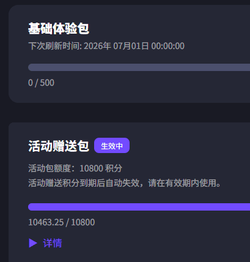
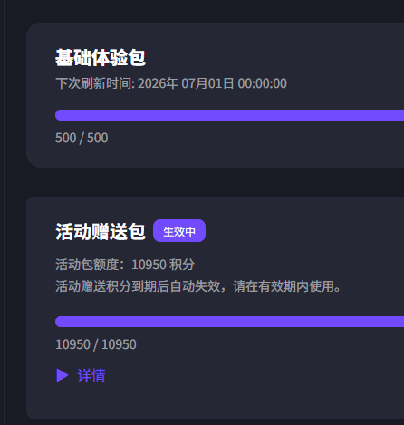
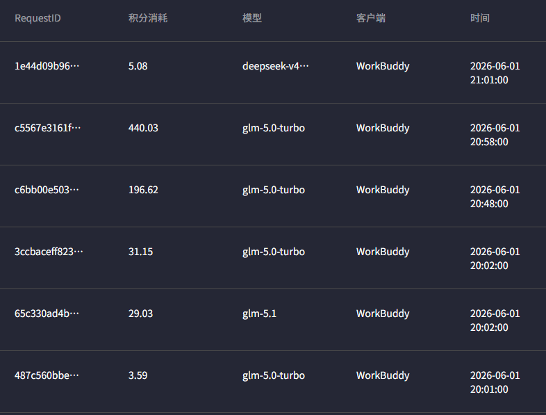

## 每月 1 日是 AI 服务公司的赈灾日

对于白嫖党来说，AI 服务公司赠送的每月或者每日额度都是不够用的。

codebuddy 现在每日送 150 积分，万一选中了 GLM 模型，一轮会话就吃掉几十几百积分，每日赠送的积分只能选一些便宜的模型。

TRAE 虽然没有明确送多少词元或者积分，但是每日都可能碰到“今天已经很晚了，请明天再来吧”，问题是经常是下午四五点啊！！

Qoder 好像就送了一次试用机会，试用完了就没法用了，卸载。

Qclaw 编程非常拉跨，卸载。

Codex ？ 等国外服务？ 需要境外手机号和 IP，我用不了哇

瞧瞧，这是 codebuddy 这个月给的赈灾积分~

我非常无语，就一个小时不到，积分就没有了？

让我看看是哪次对话吃掉了我的积分。

啊啊啊！又是 GLM 模型，这个模型为什么这么能消耗积分啊！！

【求求你了，再给我一些积分，我发誓，我再也不碰这东西了，就给我一点点积分！】（狗头，狗头保命）。