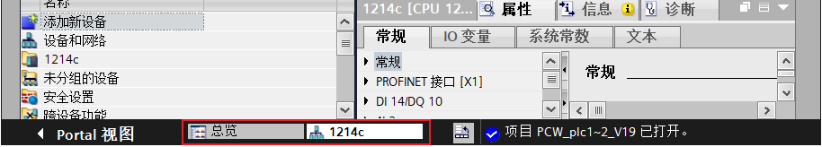
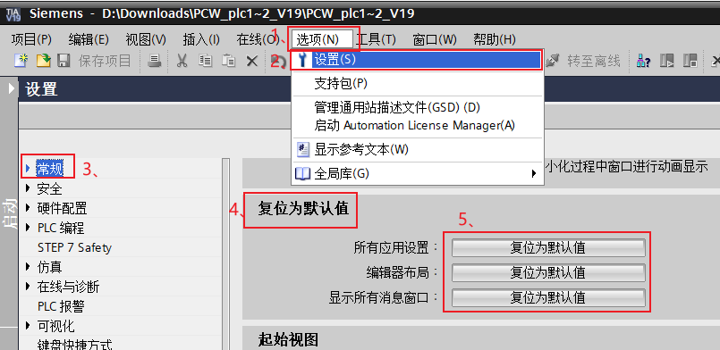
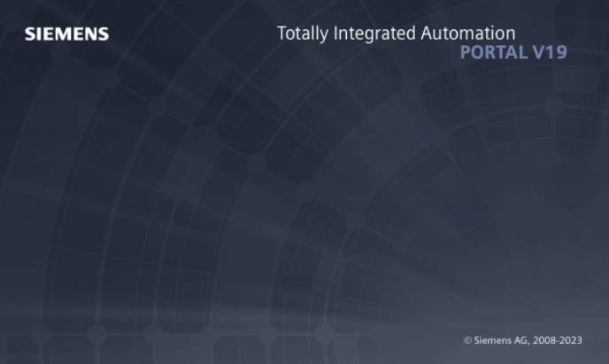
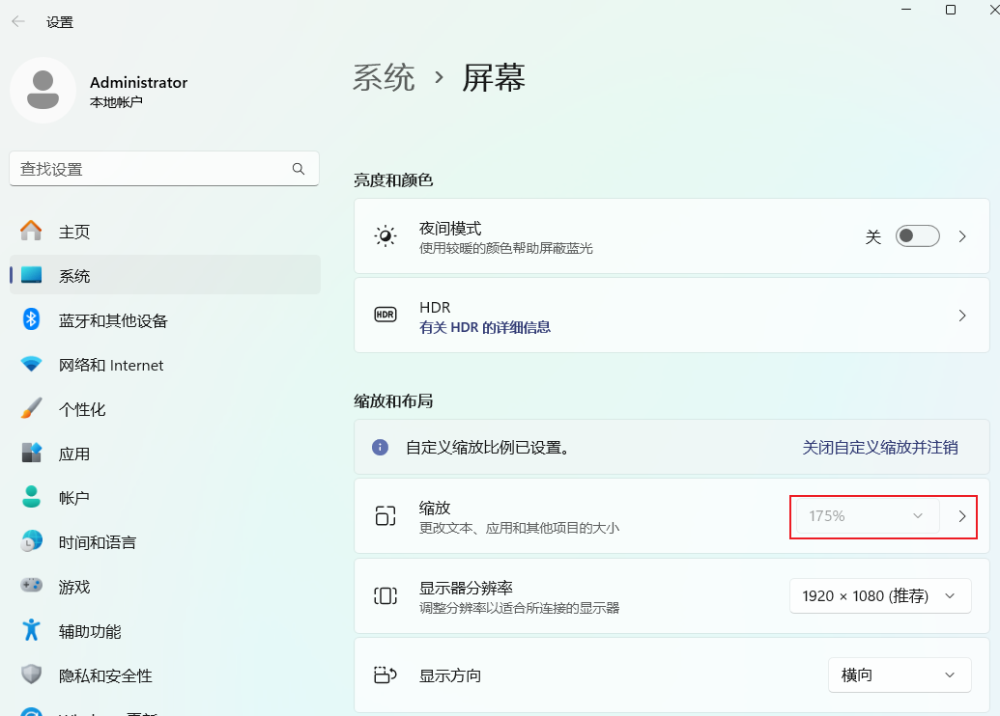
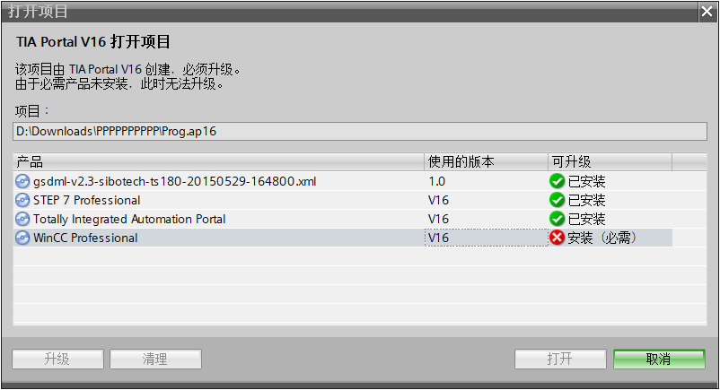

博途 TIA V19 是西门子在 2010 年底发布的一款“全集成自动化（TIA=Total Integrated Automation）”软件系统。

Rublog 之前用的 V16 版本，公司准备采用西门子近期发布的 IM60 输入输出模块，Rublog 升级使用了博途 TIA V19 版本。

Rublog 在使用过程中，遇到了一些问题，记录于下。

## 博途 TIA 标签逐渐变小甚至消失问题

这个标签是切换不同程序块的标签，点击这个标签可以快速的切换最近编辑的程序块或者画面。

第一次遇到这个问题的时候，这个标签已经变小到一两个像素高度了，很窄，想点都点不到，需要尝试挪动鼠标尝试点击才能点击成功。

这是什么原因 Rublog 也不清楚，但是我不小心找到了处理这个问题的方法，现在还在测试，不确定能否彻底解决，但是的确恢复到了高度最大的程度了。

打开博途-选项-设置-常规-复位为默认值

把三个选项都复位为默认值。

重启博途 TIA V19 ，标签高度恢复正常。

## 博途 TIA 无法打开编程页面问题

Rublog 是鼠标手势党，习惯性用鼠标手势关闭一切软件。Rublog 用鼠标手势关闭博途 TIA V19 的时候遇到问题。

Rublog 关闭软件一次之后，再次打开项目的时候发现博途 TIA V19 不断的崩溃，怎么也无法进入编程页面。

博途 TIA V19 的错误 log 里面也没有找到原因是什么，幸好之前同步系统的时候备份了一下系统，进 PE 快速的恢复了系统，嗯，博途 TIA V19 又能愉快的测试了。

注意：在任务栏右键关闭博途 TIA V19/V16 、快捷手势关闭博途 TIA V19、V16 都有可能造成博途的崩溃。之前 V16 版本也出现过这个问题，虽然不像 V19 这样严重。

原因：未知。

处理办法：使用的过程中多注意一些，不使用任务栏的右键关闭，在鼠标手势软件中屏蔽博途软件。

类似问题：使用TIA  V19 ，可打开项目，一旦打开项目视图就报错，some infomation lost，然后就会自动关闭。

吓死了，谢这篇文章的时候还鼠标手势关闭了一次。幸好没有出现问题。

## 许可证问题

这个根据需要购买对应的许可证，我也没办法啦。

如果资金充足的话，可以购买最大的授权。

## 软件更新器问题

V19 之前版本的博途都是有专门的更新客户端的，V19 改为了前后端模式，前端使用网页，而且需要登录。

登录需要 Windows 11 的账号和密码，如果没有密码需要先设置一个账号密码。

[如何设置 Windows 11 账号密码](https://support.hp.com/cn-zh/document/ish_5054856-5025509-16)

也可以找文章开头的更新链接，使用离线更新包，下载更新包之后双击安装更新。

## 无法全屏问题

部分用户遇到了博途 TIA V19 无法全屏的问题，点击全屏，会在屏幕上面或者下面留一部分屏幕，无法把博途 TIA V19 整个屏幕展开。

解决办法：缩放改成百分百即可

Rublog 屏幕长期缩放 115%，暂时没有遇到这个无法全屏问题。

## 项目中的可选产品缺失

V19 程序打开时显示 WinCC Unified 安装（可选）

由于必需产品未安装，WinCC Professional 安装（必需）

必需安装的软件是需要重新打开安装包，把需要的产品安装上，比如上图的 WinCC Professional。

有些是可以选装或者升级的。但是建议可选的也安装一下。升级之后可能造成后期打开的时候也需要安装升级后的软件。

## 常用博途库在哪儿下载？

[LGF 库 V5.1.1 博途 V19 V18 V17 V16 版本](https://support.industry.siemens.com/cs/document/109479728/library-of-general-functions-(lgf)-for-simatic-step-7-(tia-portal)-and-simatic-s7-1200-s7-1500?dti=0&lc=en-WW)

[通讯相关库 博途 V19 V18 V17 V16 版本](https://support.industry.siemens.com/cs/document/109780503/libraries-for-communication-for-simatic-controllers?dti=0&lc=en-WW)

[Library of Basic Controls LBC  博途 V19 V18 V17 V16 版本](https://support.industry.siemens.com/cs/document/109792175/library-of-basic-controls-(lbc)?dti=0&lc=en-WW)

## 有编程相关的资料吗

1、博途 V19 V18 V17 V16 的帮助手册。