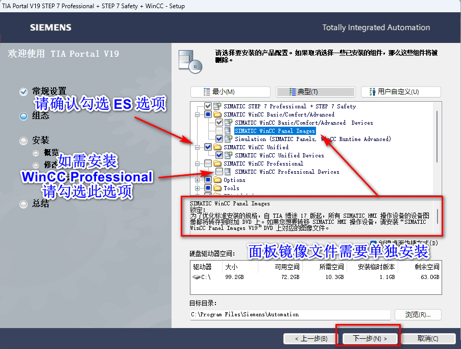
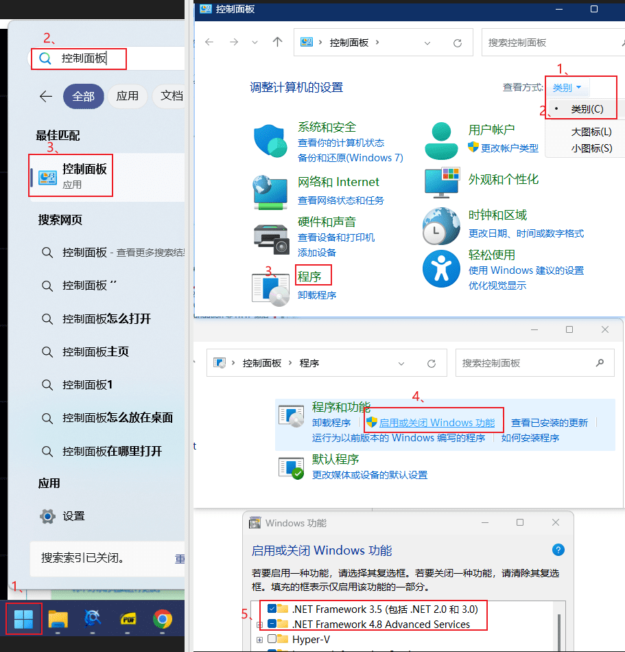
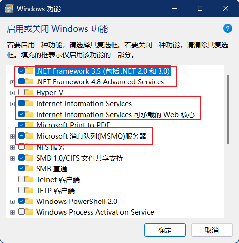

博途 TIA V19 是西门子在 2010 年底发布的一款“全集成自动化（TIA=Total Integrated Automation）”软件系统。

Rublog 之前用的 V16 版本，公司准备采用西门子近期发布的 IM60 输入输出模块，Rublog 升级使用了博途 TIA V19 版本。

Rublog 在使用过程中，遇到了一些问题，记录于下。

## 安装问题 1

博途 TIA V19 之前版本都分 PRO 和 ADV 版本，下载的时候只需要按需要的版本下载对应的 ISO 即可。

用过的用户都知道，选 ADV 版本是为了兼容经典 WINCC ，V19 的下载页面只有专业版，这怎么办呢？

解答：博途 TIA V19 是 PRO 和 ADV 多合一的 ISO 文件，PRO ISO 文件中包含 PRO 和 ADV 版本，安装的时候选择对应版本安装即可。



DVD2是硬件支持包、开源软件、以及一些工具软件等。

下载链接 [博途 TIA V19](https://support.industry.siemens.com/cs/document/109820994/simatic-step-7%EF%BC%88%E5%8C%85%E5%90%ABsafety%EF%BC%89%E3%80%81s7-plcsim-%E5%92%8C-wincc-v19-%E8%AF%95%E7%94%A8%E7%89%88%E4%B8%8B%E8%BD%BD?dti=0&lc=zh-CN)

下载链接 [博途 TIA V19 的升级包，需先安装 V19](https://support.industry.siemens.com/cs/document/109820989/updates-for-simatic-wincc-unified-pc-runtime-v19?dti=0&dl=en&lc=zh-CN)

需要注册账号，登录即可下载，速度很快的，比某盘、某盘都快。

## 安装问题 2

博途 TIA V19 软件或者相关软件需要 .Net Framework 3.5 环境，所以需要先安装这个环境。

打开开始菜单搜索 “控制面板”，“程序”，“启用或关闭Windows功能”，勾选“.Net Framework 3.5”相关选项，确定。



## 安装问题 3

第一次安装博途 TIA 时，肯定会遇到安装失败问题。

```setup log
08:45:08 |ERROR    AdsWorkerForeignExe::GetInstallResult():  - 1603: assuming unknown error, because return value is not in OK-list which is only defined. Please check the corresponding log file for more detailed information
08:45:08 | FAIL!                     SetupUnit                  (URLRewrite2)               Failed    Foreign   AddLocal  
08:45:29 | OK                        SetupUnit                  (WebView2_Runtime)          Complete  Foreign   AddLocal  
08:45:29 | FAIL!                     Checkpoint                 (E)                         Complete
08:45:29 |ERROR    ExecutionEngine::StartNextStepAsync():  - Execution has been cancelled. Probably because of some process(es) running on the machine
```

该问题是系统未能成功安装 URLRewrite2 软件，经过下载该软件手动安装得知，需要先安装微软 IIS 服务（Internet Information Services）。

安装该服务之后，博途安装包可以自己安装 URLRewrite2 软件。

一般经典版 Wincc 需要消息队列服务，所以，顺手也安装上消息队列服务。



安装 IIS 服务和消息队列服务后重启，继续安装即可。

``` setup fail log
17:48:10 | OK                        SetupUnit                  (URLRewrite2)               Complete  Foreign   AddLocal  
17:49:02 |ERROR    AdsWorkerForeignExe::GetInstallResult():  - 2: assuming unknown error, because return value is not in OK-list which is only defined. Please check the corresponding log file for more detailed information
17:49:02 | FAIL!                     SetupUnit                  (WebView2_Runtime)          Failed    Foreign   Reinstall 
17:49:02 | FAIL!                     Checkpoint                 (E)                         Complete
17:49:02 |ERROR    ExecutionEngine::StartNextStepAsync():  - Execution has been cancelled. Probably because of some process(es) running on the machine
```

同事用Windows 10 系统安装，失败，是 WebView2_Runtime 安装问题，可以尝试[微软官方下载软件](https://developer.microsoft.com/zh-cn/microsoft-edge/webview2?form=MA13LH)后手动测试安装排查问题，初步怀疑系统版本或者依赖库未安装。

## 许可证问题

这个根据需要购买对应的许可证，我也没办法啦。

如果资金充足的话，可以购买最大的授权。


## TIA PROTAL V19安装时，提示SIA.ini not  found

这个问题一般是 ISO 双击打开，再双击 Setup.exe 直接安装，重启电脑之后临时文件删除造成的。

正确的姿势是右键 ISO ，点击挂载，再双击 Setup.exe 安装，重启之后再重新挂载一遍。

或者右键，解压到一个文件夹，打开文件夹之后双击 Setup.exe 安装。

## 有没有安装教程

有的哇，而且是官方的。

[这个是安装Wincc的教程，可以作为tia的安装教程](https://www.ad.siemens.com.cn/productportal/Prods/HMI/WinCC/Q14_FAQ/UnifiedPC_8.html)