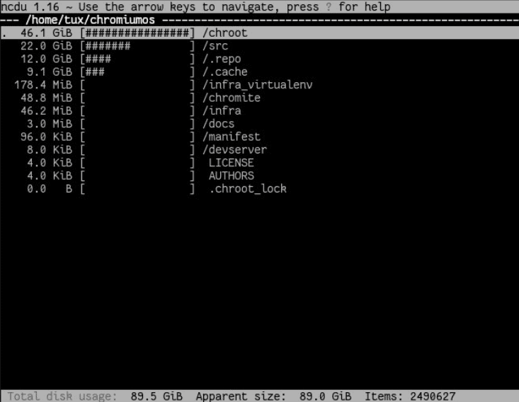
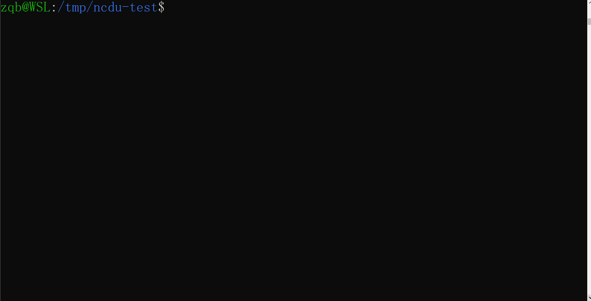
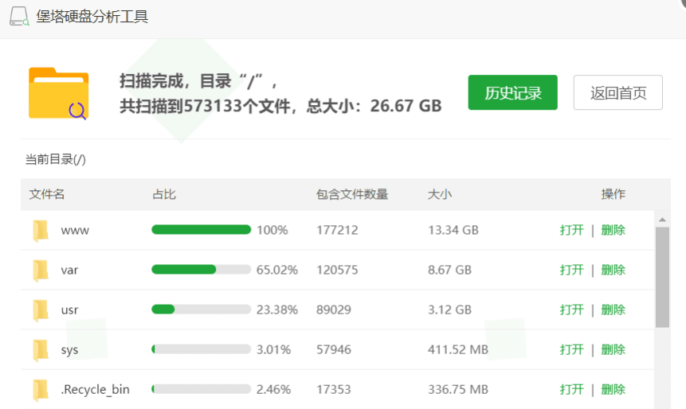

- [背景](#背景)
- [ncdu 安装使用](#ncdu-安装使用)
- [ncdu 示例](#ncdu-示例)
- [其他](#其他)
  
## 背景

Rublog 有几个 vps 运维几个网站，有几次发现某个 vps 磁盘会占满，导致服务停止。

Rublog 不想额外付费扩容，就只有删掉一些文件了。

为了快速回收空间，最有效的做法当然是挑大文件下手了。linux 下获取文件大小，一般是使用 `du` 命令

```bash
du -sh
```

即可看到文件夹占用空间大小。但 `du` 执行很慢，效率低下。

经过多次搜索，发现了一个软件——`ncdu` ，shell 可用的，无需桌面服务。

软件在 shell 表现如图



## ncdu 安装使用

ubuntu 下可以

```csharp
sudo apt-get install ncdu
```

如果是需要在没有 sudo 权限没有网络的服务器上使用，那么一种方式是将本地安装好的 bin 直接拷贝上去，另一种方式就是把源码拷贝上去编译生成了。

看下帮助，`ncdu` 支持一些参数，包括排除一些文件，导出结果到文件中等。

```vhdl
ncdu -h
ncdu <options> <directory>

-h This help message
-q Quiet mode, refresh interval 2 seconds
-v Print version
-x Same filesystem
-r Read only
-o FILE Export scanned directory to FILE
-f FILE Import scanned directory from FILE
-0,-1,-2 UI to use when scanning (0=none,2=full ncurses)
--si Use base 10 (SI) prefixes instead of base 2
--exclude PATTERN Exclude files that match PATTERN -X, 
--exclude-from FILE Exclude files that match any pattern in FILE
--exclude-caches Exclude directories containing CACHEDIR.TAG
```

可以直接在需要分析的目录下执行 `ncdu`， 等待 ncdu 扫描完毕，就会出现一个交互式的界面。

在这里可以看到每个目录的大小，使用方向键或 Enter 键即可进入和退出具体的目录。

比如发现某个目录占用空间很大，那么就可以一路跟下去找到罪魁祸首，找到之后确认可以删除的话，不用退出 ncdu，直接选中后按 `d` 即可。

删除得差不多了，则按 `q` 退出

## ncdu 示例



常用动作如上图

## 其他

使用宝塔面板的可以安装对方提供的付费软件“堡塔硬盘分析工具”。这个软件是基于 ncdu 实现的，安装宝塔面板的可以直接运行 `ncdu`。

界面如下图

